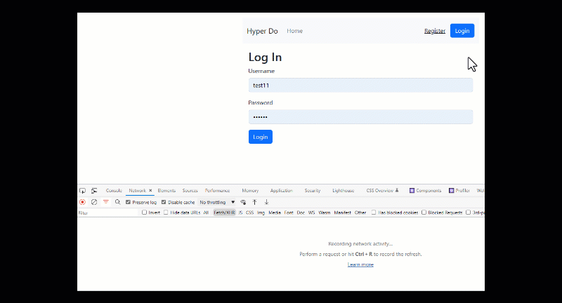

# Hyper-DO Todo List

This is a todo-list made with React(frontend) and a simple webserver written in NodeJS(backend). 



This is an learning by experience project.

## Features

* Multi-user support (Login/Register)
* Postgres database using Sequelize
* Express for the APIs
* bcrypt for encryption/decryption
* dotenv for environment variables
* jsonwebtoken for token generation
* React + react-bootstrap for UI 
* axios for API calls

## Usage & Requirements
* You need to have npm 16+ installed
* You need to have a database on Postgres and add the information to the .env file in the following format:

DB_USERNAME=test

DB_PASSWORD=khgJHGfy4656

DB_URL=someurl

DB_PORT=5432

DB_NAME=dbname

JWT_SECRET=genarate using: "openssl rand -hex 32"

APP_PORT=5000

API_ENDPOINT=http://localhost:5000/

APP_CLIENT=http://localhost:3000/


For the API, in root folder run npm install and then npm start
```
npm i && npm start
```

For the UI, go to "client" folder and run npm install and npm start
```
npm i && npm start
```

The database tables will be created on the first run and some dummy data will be seeded to the tables. A .dbinit file will be created to record the database creation

# License

MIT
